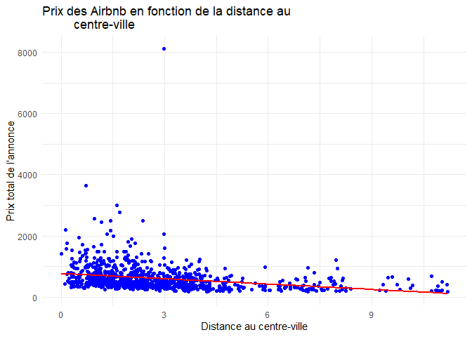
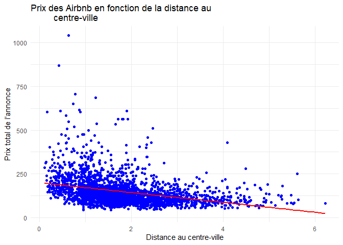
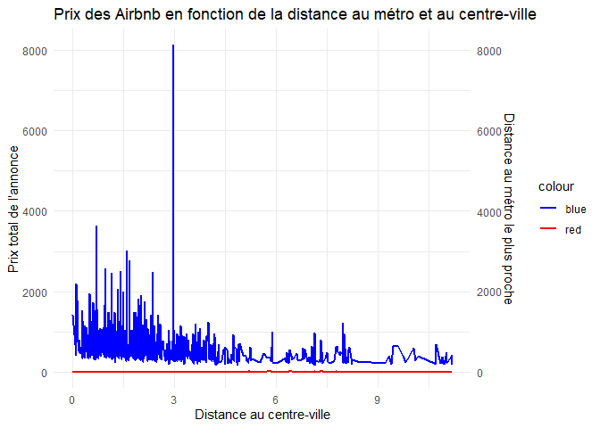
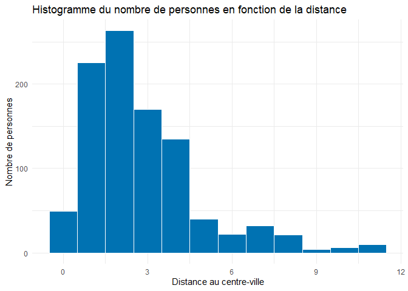

objectif2
================
obj2
2023-11-13

### chargement des librairies

``` r
library(ggplot2)
library(dplyr)
```

    ## 
    ## Attachement du package : 'dplyr'

    ## Les objets suivants sont masqués depuis 'package:stats':
    ## 
    ##     filter, lag

    ## Les objets suivants sont masqués depuis 'package:base':
    ## 
    ##     intersect, setdiff, setequal, union

### chargement des données

``` r
amsterdam <- read.csv("data/amsterdam_weekends.csv")
athens <- read.csv("data/athens_weekends.csv")
barcelona <- read.csv("data/barcelona_weekends.csv")
berlin <- read.csv("data/berlin_weekends.csv")
budapest <- read.csv("data/budapest_weekends.csv")
lisbon <- read.csv("data/lisbon_weekends.csv")
london <- read.csv("data/london_weekends.csv")
paris <- read.csv("data/paris_weekends.csv")
rome <- read.csv("data/rome_weekends.csv")
vienna <- read.csv("data/vienna_weekends.csv")
```

\###2A: Fonction pour voir le prix par rapport à la distance au
centre-ville dans une seule ville (À transformer en geom point avec une
ligne de regression)

``` r
graphe<-function(data){
  
  line_chart<- ggplot(data,aes(x=dist, y=realSum))+
    geom_point(color="blue")+
    # Regression line
    geom_smooth(method = "lm", se = FALSE, color = "red")+
    labs(title="Prix des Airbnb en fonction de la distance au
         centre-ville",
         x="Distance au centre-ville",
         y="Prix total de l'annonce") +
    theme_minimal()
  
  line_chart
  
}
```

``` r
graphe(amsterdam)
```

    ## `geom_smooth()` using formula 'y ~ x'

<!-- -->

``` r
graphe(athens)
```

    ## `geom_smooth()` using formula 'y ~ x'

<!-- -->

\###2b Graphe (geom_line) avec à la fois le prix en fonction de la
distance à l’arrêt de metro le plus proche et aussi la distance au
centre-ville (Double axe y)

``` r
library(ggplot2)

graphe <- function(data) {
  
  # Line graph with two y-axes
  dual_axis_chart <- ggplot(data, aes(x = dist)) +
    
    # Price in relation to distance to the nearest metro station
    geom_line(aes(y = realSum, color = "blue"), size = 1) +
    
    # Distance to the city center on the secondary y-axis
    geom_line(aes(y = metro_dist, color = "red"), size = 1) +
    
    scale_y_continuous(
      name = "Prix total de l'annonce",
      sec.axis = sec_axis(~., name = "Distance au métro le plus proche")
    ) +
    
    labs(
      title = "Prix des Airbnb en fonction de la distance au métro et au centre-ville",
      x = "Distance au centre-ville"
    ) +
    
    theme_minimal() +
    scale_color_manual(values = c("blue", "red"))
  
  dual_axis_chart
}

# Example usage
# Assuming your data frame is named "your_data"
# Replace "your_data" with the actual name of your data frame
graphe(amsterdam)
```

<!-- -->

\###2c: Fonction Histogramme nombre de personnes pour dist

``` r
library(ggplot2)

graphe_histogramme <- function(data) {
  
  # Histogram of the number of people for each distance value
  histogram_chart <- ggplot(data, aes(x = dist)) +
    geom_histogram(binwidth = 1, fill = "#0072B2", color = "white") +
    
    labs(
      title = "Histogramme du nombre de personnes en fonction de la distance",
      x = "Distance au centre-ville",
      y = "Nombre de personnes"
    ) +
    
    theme_minimal()
  
  histogram_chart
}
```

\###Exemple d’utilisation de la fonction histo_obj2

``` r
graphe_histogramme(amsterdam)
```

<!-- -->

``` r
graphe_histogramme(paris)
```

<!-- -->

``` r
library(ggplot2)

graphe_violon <- function(data) {
  
  # Violin plot with points
  violin_chart <- ggplot(data, aes(x = room_type, y = realSum, color = room_type)) +
    geom_violin() +
    geom_point(position = position_jitter(width = 0.2, height = 0), alpha = 0.5) +
    
    labs(
      title = "Prix des Airbnb en fonction du type de chambre",
      x = "Type de chambre",
      y = "Prix total de l'annonce"
    ) +
    
    theme_minimal() +
    scale_color_manual(values = c("#0072B2", "#D55E00", "#009E73"))
  
  violin_chart
}

# Example usage
# Assuming your data frame is named "your_data"
# Replace "your_data" with the actual name of your data frame
graphe_violon(amsterdam)
```

<!-- -->
